    

<div id="top"></div>


<!-- PROJECT LOGO -->
<br />
<div align="center">
    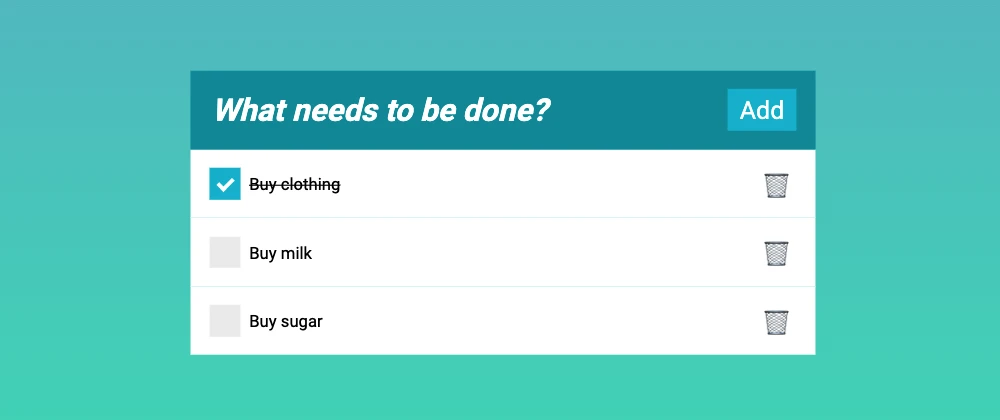
  <h2 align="center">ToDo Application using containers</h2>
  <h3 align="center">Create a versatile Todo app using (Item/Model) based containers.</h3>
</div>


<!-- TABLE OF CONTENTS -->
<details>
 <ol class="list-group list-group-numbered">
     <li class="list-group-item"> <a href="#Overview">Overview </a></li>
  <li class="list-group-item"> <a href="#Use-Cases">Use Cases</a> </li>
  <li class="list-group-item"> <a href="#Defining-a-Task">Defining a Task</a> </li>
   <li class="list-group-item"> <a href="#MVC-Model">MVC Model</a> </li>
</ol>
</details>


<div id="Overview">
  
<!-- ABOUT THE PROJECT -->
## Overview
    
  The goal of the **homework** is to create an **application** to manage you tasks. 
    It should have all the features of **main application** such as menues, actions and toolbar. 
    The **application** must store an archive of all the **pending** and **finished** tasks.
    with disgner we have obtiened this form.
    <br />
<div align="center">
    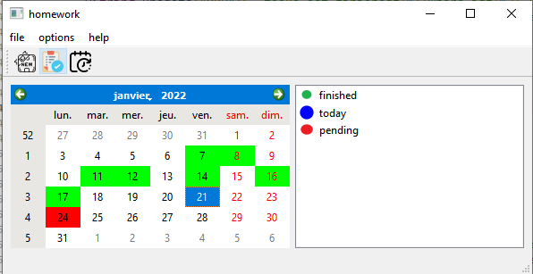
   <p align="center">Overview of our application.</p>
</div>
    
   when u open the application u can see that the **taks** that are **finished** are in **green** , **today tasks** are with **blue** and they can be **finiched or not** and **pending** with **red** ,and this the constructor of our application
    
```cpp
homework::homework(QWidget *parent)
    : QMainWindow(parent)
    , ui(new Ui::homework)
{
//    makeconnexion();
     QTextStream out(stdout);
    ui->setupUi(this);
   Dialog F;
     makeconnexion();
   QTextCharFormat fmt,fmt1,fmt2;
   fmt.setBackground(Qt::red);
   fmt1.setBackground(Qt::green);
   fmt2.setBackground(Qt::blue);
    auto model =new QSqlQueryModel;
    QString cell1=QDate::currentDate().toString("yyyy-MM-dd");
//    QString cell1=QDate::currentDate().toString("yyyy-MM-dd");
    auto query= QSqlQuery(F.getdata());
    QString view{"select  finished,datework from tasks"};
    query.exec(view);

    while (query.next()) {
           QString finished = query.value(0).toString();
            QString datework = query.value(1).toString();
           QDate Date = QDate::fromString(datework,"yyyy-MM-dd");
           QString d=Date.toString("yyyy-MM-dd");
           if( finished=="0" && datework<cell1)
        ui->calendarWidget->setDateTextFormat(Date, fmt1);

           if( finished=="2" && datework>cell1)
        ui->calendarWidget->setDateTextFormat(Date, fmt);

             if( finished=="1" || datework==cell1)
             ui->calendarWidget->setDateTextFormat(Date, fmt2);

             if(finished=="2" && datework==cell1 ){
           ui->calendarWidget->setDateTextFormat(Date, fmt2);
           QString upadate{"UPDATE  tasks set  finished=1 where finished=2"};
           query.exec(upadate);
             }
             if( finished=="1" && datework<cell1){
                 ui->calendarWidget->setDateTextFormat(Date, fmt1);
                 QString upadate{"UPDATE  tasks set  finished=0 where finished=1 "};
                 query.exec(upadate);
             }
out<<d;

       }

}
};
    
```
<p align="right">(<a href="#top">back to top</a>)</p>
    

    
<div id="Use-Cases">
  
<!-- ABOUT THE PROJECT -->
## Use Cases
    
Here is a list of **cases** that the user could **perform** with our app:

    1. A user should be able to close the application of course.
    
   <p align="center">
     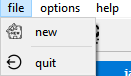
   </p> 
    
    this the code of this action.
   
   ```cpp
   void homework::on_actionquit_triggered()
{
     QApplication::quit();
}
   ```
   2. A Todo application cannot be useful, unless it offers the possibility of creating new tasks.
      * The essential components of a task will be defined later


   3. The qcalendar show the tree type of tasks and when u click on item of the calendar its shows the list of tasks depanding on the status of the task :
      *  first  it's shows the  **today tasks** they are with **blue** color (they can be finished or not).
      * second pending task with **red** color (tasks for the future) .
      * Finally,  finished tasks with **green** color.
    <div class="to">
   <p align="center">
     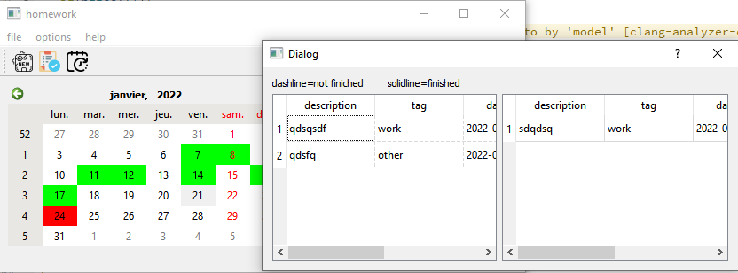
       <p align="center">today tasks.</p>
       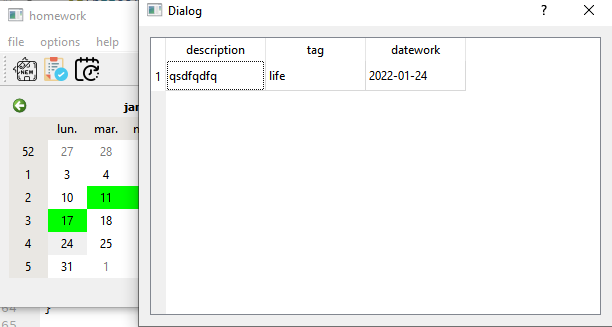
        <p align="center">pending tasks.</p>
       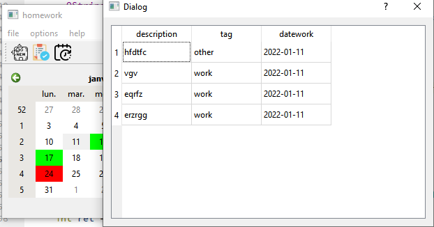
       <p align="center">finished tasks.</p>
   </p> 
    </div>
    
    
this the code.
     <br/>
    4. The user could show today,pending and finished views.
    
   <p align="center">
     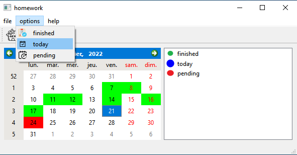
         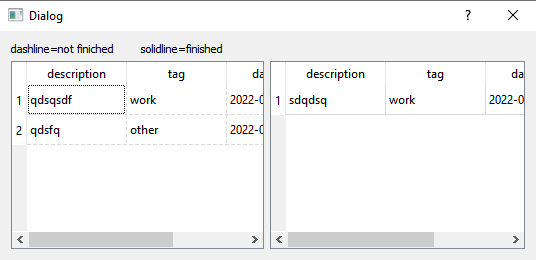
       <p align="center">today tasks.</p>
       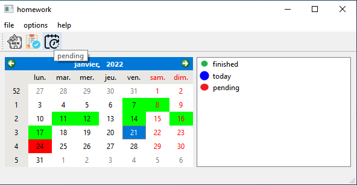
    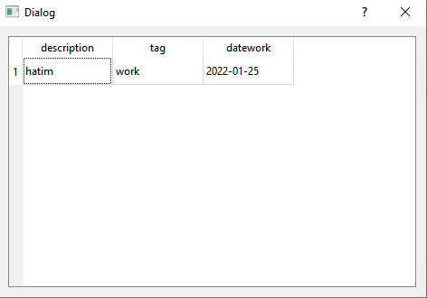
        <p align="center">pending tasks.</p>
       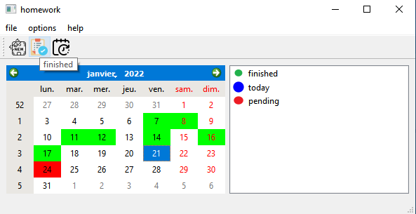
    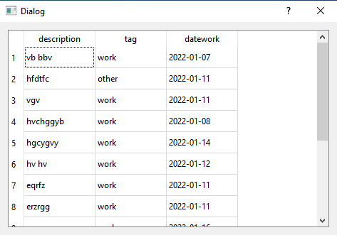
       <p align="center">finished tasks.</p>
   </p> 

   5. The user could set a task to finished if he finished it.
     <p align="center">
     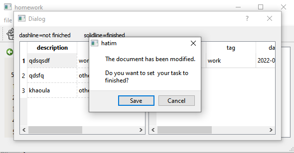
           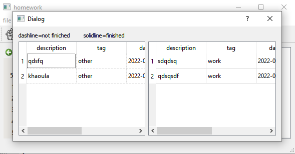
       <p align="center">set to finished.</p>
         </p> 
   6. when the day pass taks of today become finished and when the day arrive to pending taks they become today taks(the code is in the constroctor).
   7. Finally, the tasks entered to our application must remains in the app in future use.
    <p align="right">(<a href="#top">back to top</a>)</p>
    
    
<div id="Defining-a-Task">
  
<!-- ABOUT THE PROJECT -->
## Defining a Task
   
                                    
    
  <div id="MVC-Model">
  
<!-- ABOUT THE PROJECT -->
## MVC Model
